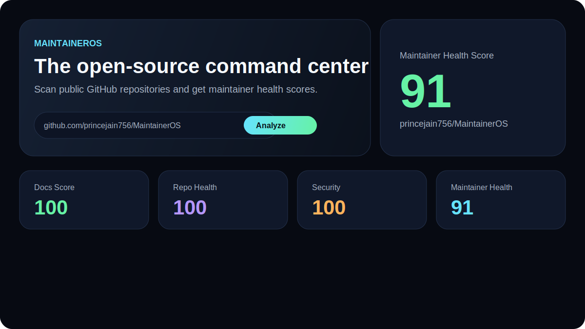
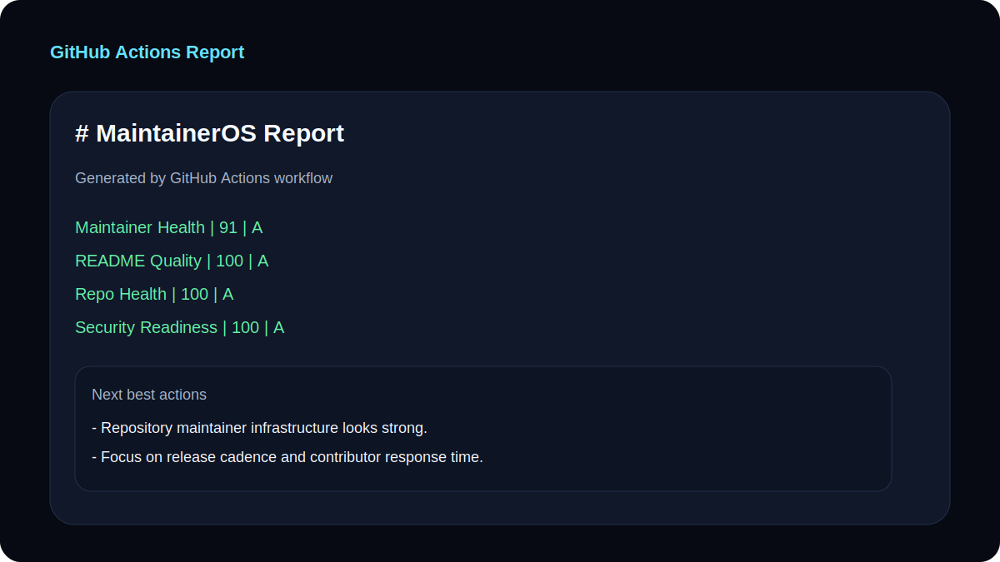

# MaintainerOS

The open-source command center for healthier repositories.

[](https://maintaineros.prince.sh)
[](https://github.com/princejain756/MaintainerOS/releases)
[](LICENSE)
[](https://github.com/princejain756/MaintainerOS/actions/workflows/ci.yml)

**Live demo:** [https://maintaineros.prince.sh](https://maintaineros.prince.sh)

MaintainerOS helps open-source maintainers reduce repetitive work across documentation, issue triage, pull request review, release preparation, contributor onboarding, and security readiness.

Paste a public GitHub repository URL and MaintainerOS fetches live data from the GitHub API — README, repository files, recent commits, open issues, and open pull requests — then generates actionable scores and maintainer recommendations.

## Why MaintainerOS exists

Open-source maintainers do more than write code. They review pull requests, triage issues, prepare releases, improve documentation, help contributors, and protect project quality.

That work is essential, repetitive, and often invisible — especially for solo maintainers and small teams without paid tooling.

MaintainerOS is maintainer infrastructure for the broader OSS ecosystem: a free command center that makes repo health, security readiness, and day-to-day maintenance workflows faster and more consistent.

## Features

- **Live GitHub repository scanning** — fetches README, repo files, commits, issues, and pull requests from the public GitHub API
- **Stale backlog detection** — flags open issues and PRs unchanged for 30+ days
- **Exportable JSON reports** — download structured maintainer health data from the dashboard or CLI
- **Optional GitHub token support** — higher API limits for local use and CI (stored locally in browser only)
- **MaintainerOS Report Workflow** — generates Markdown maintainer health reports in GitHub Actions on demand or weekly
- **Repo Health Scanner** — checks README, license, contributing guide, issue templates, PR templates, CI, changelog, lockfile, and security policy
- **README Audit** — scores structure, missing sections, setup clarity, examples, and contributor usefulness
- **Issue Triage Helper** — suggests labels, priority, missing information, and maintainer response templates
- **PR Review Assistant** — estimates risk, merge readiness, review checklist, and test suggestions
- **Release Notes Generator** — turns commit messages into grouped changelogs and version bump suggestions
- **Security Readiness Check** — reviews disclosure policy, lockfile presence, security workflows, dependency footprint, and risky scripts

## Demo

Try the live app: [https://maintaineros.prince.sh](https://maintaineros.prince.sh)

1. Paste a public GitHub repository URL
2. Click **Analyze repository**
3. Review maintainer health, repo health, security readiness, stale backlog, issue triage, PR review, and release notes
4. Export a JSON report or run the GitHub Actions workflow for automated Markdown output

## Screenshots

### Maintainer dashboard



### Repo health scanner


### GitHub Actions report



## Quick start

### Try the live app

Open [https://maintaineros.prince.sh](https://maintaineros.prince.sh), paste a public GitHub repository URL, and click **Analyze repository**.

### Run locally

```bash
git clone https://github.com/princejain756/MaintainerOS.git
cd MaintainerOS
npm install
npm run dev
```

Then open the local URL printed by Vite.

## Installation

```bash
npm install
```

## Usage

```bash
npm run dev
```

Example repositories to scan:

- `https://github.com/princejain756/MaintainerOS`
- `https://github.com/facebook/react`
- `https://github.com/vercel/next.js`

Generate a Markdown maintainer report:

```bash
npm run report -- --repo princejain756/MaintainerOS --output maintaineros-report.md
```

Generate a JSON report for automation:

```bash
npm run report -- --repo princejain756/MaintainerOS --output maintaineros-report.json --format json
```

Use a GitHub token for higher API limits in CI or local runs:

```bash
GITHUB_TOKEN=ghp_xxx npm run report -- --repo princejain756/MaintainerOS --output maintaineros-report.md
```

## Test

```bash
npm test -- --run
```

## Build

```bash
npm run build
```

## Tech Stack

- React
- TypeScript
- Vite
- Vitest
- ESLint
- GitHub REST API

## Project structure

```text
src/
  App.tsx                 # Maintainer dashboard UI
  githubClient.ts         # Live GitHub repository scanning
  maintainerEngines.ts    # Scoring and analysis logic
  reportFormatter.ts      # Markdown and JSON report output
scripts/
  generate-report.ts      # CLI for local and CI report generation
```

## MaintainerOS GitHub Action

MaintainerOS includes workflow infrastructure, not only a web dashboard.

Run a maintainer health report locally:

```bash
npm run report -- --repo princejain756/MaintainerOS --output maintaineros-report.md
```

Or use the included GitHub Actions workflow:

```text
.github/workflows/maintaineros-report.yml
```

The workflow runs manually or weekly, generates `maintaineros-report.md`, uploads it as an artifact, and can fail when the maintainer score drops below a minimum threshold.

See [docs/github-action.md](docs/github-action.md).

## Documentation

- [GitHub Action guide](docs/github-action.md)
- [Example maintainer report](docs/example-report.md)
- [Project roadmap](docs/roadmap.md)
- [ROADMAP.md](ROADMAP.md)
- [Security policy](SECURITY.md)
- [Contributing guide](CONTRIBUTING.md)

## Project Roadmap

- [x] GitHub token support for higher API limits
- [x] Stale issue and stale PR detection
- [x] Exportable JSON report format
- [x] Security workflow and risky script detection improvements
- [ ] AI-assisted PR review summaries
- [ ] GitHub Actions workflow audit
- [ ] Contributor onboarding score
- [ ] Maintainer workload analytics
- [ ] GitHub App integration for automated issue and PR comments

## Example use cases

### For maintainers

- Understand whether a repository is ready for contributors
- Spot stale issues and pull requests before backlog grows
- Improve issue quality with response templates
- Review pull requests with consistent risk checklists
- Prepare cleaner changelogs and releases
- Identify missing security and contribution infrastructure

### For contributors

- Understand what a project expects before opening an issue or PR
- See what information maintainers need
- Improve project documentation before asking for adoption

### For open-source programs

- Evaluate repository readiness
- Surface maintenance and security risks
- Encourage healthier contribution workflows across the ecosystem

## Ecosystem importance

Maintainer burnout and repo hygiene are ecosystem-wide problems — not niche developer conveniences. Projects of every size need:

- Clear contributor onboarding
- Consistent issue and PR quality
- Security disclosure paths
- Reproducible dependency practices
- Sustainable release and documentation habits

MaintainerOS targets that gap with free, browser-based tooling plus CLI and GitHub Actions automation. It is MIT-licensed, actively maintained, and designed to help maintainers who cannot afford enterprise maintainer platforms.

## Security

MaintainerOS is a **public web tool**. Anyone can visit [maintaineros.prince.sh](https://maintaineros.prince.sh) and scan **public** GitHub repositories. That is intentional.

### What is public

- The website itself is publicly accessible over HTTPS
- Anyone can paste a public GitHub repository URL and run a scan
- Scan results are generated in the browser from publicly available GitHub data

### What MaintainerOS does not store or expose

- No OpenAI API keys in the frontend
- No GitHub personal access tokens sent to MaintainerOS servers
- No user accounts or login system
- No backend database of scanned repositories
- No access to private repositories
- No access to a visitor's GitHub account

The live app uses the **public GitHub REST API without authentication** by default. It only requests repository data that GitHub already exposes for public repos, such as README content, repository files, commits, open issues, and open pull requests.

Optional GitHub tokens entered in the browser are stored **locally only** and sent directly to GitHub for higher rate limits. They are never transmitted to MaintainerOS infrastructure.

### CLI and GitHub Actions

The report CLI and GitHub Actions workflow run in trusted environments:

- Locally on a maintainer's machine, or
- Inside GitHub Actions using the repository context

Optional tokens such as `GITHUB_TOKEN` are only intended for CI or local automation. They should never be embedded in frontend code or committed to the repository.

### Current limitations

- Public GitHub API rate limits apply to unauthenticated scans
- Only public repositories can be analyzed in the current version
- The web app does not yet include abuse protection or authenticated private-repo scanning

### Reporting vulnerabilities

If you discover a security issue in MaintainerOS itself, please report it responsibly. Do not open a public GitHub issue for vulnerabilities.

See [SECURITY.md](SECURITY.md) for the disclosure process.

## Contributing

Contributions are welcome. See [CONTRIBUTING.md](CONTRIBUTING.md) for setup, testing, and pull request guidelines.

## License

MIT. See [LICENSE](LICENSE).
